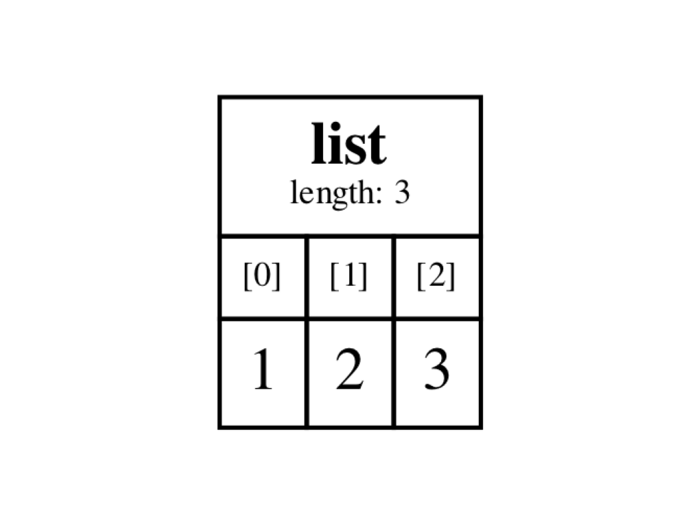
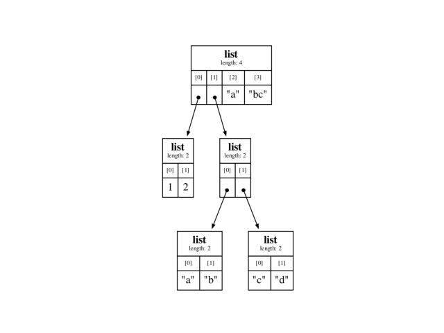
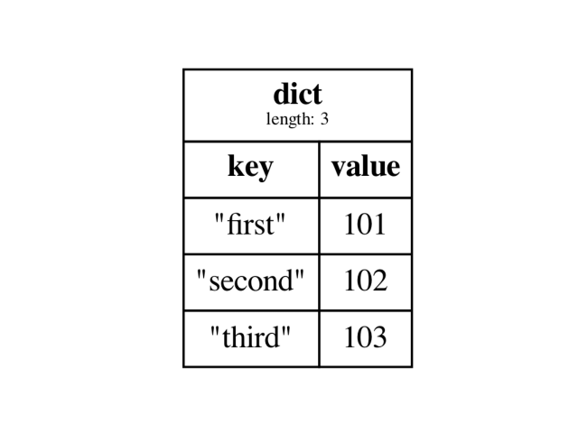
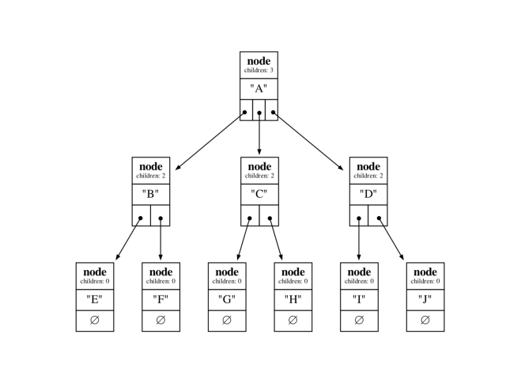

# Structoscope


Structoscope is a Python library for visualizing and inspecting any data structure.

## Install

The only external dependency is the `graphviz` binary, which you can install buy running the following command in the terminal.  

```
brew install graphviz
```

Now you can install structoscope by running the following command in the terminal.

```
pip3 install structoscope
```

## Documentation

You can find the documentation for this project [here](https://structoscope.readthedocs.io/en/latest/).

## Examples

### Lists

Structoscope can easily display Python lists:

```python
from structoscope import Scope

s = Scope()
testList = [1,2,3]
s.print(testList)
input() # block the main thread
```



### Multi-dimensional Lists

It can even display multi-dimensional lists:

```python
from structoscope import Scope

s = Scope()
testList = [
    [1,2],
    [
        ['a', 'b'],
        ['c', 'd']
    ],
    'abc'
]
s.print(testList)
input() # block the main thread
```



### Dictionaries

Or it can display dictionaries:

```python
from structoscope import Scope

s = Scope()
testDict = {
    'first' : 101,
    'second' : 102,
    'third' : 103,
}
s.print(testDict)
input() # block the main thread
```



### Trees

It can even display trees:

```python
from structoscope import Scope

class Node:
    def __init__(self, val=None, children=[]):
        self.val = val
        self.children = children

s = Scope(
    dataMemberName='val',
    childrenMemberName='children'
)

node9 = Node(val='J')
node8 = Node(val='I')
node7 = Node(val='H')
node6 = Node(val='G')
node5 = Node(val='F')
node4 = Node(val='E')
node3 = Node(val='D', children=[node8, node9])
node2 = Node(val='C', children=[node6, node7])
node1 = Node(val='B', children=[node4, node5])
root = Node(val='A', children=[node1, node2, node3])

s.print(root)
input() # block the main thread
```



## What's up with the name?

I think of it as a *stethoscope* whose purpose is to inspect a `struct`. A Struct-o-scope!
